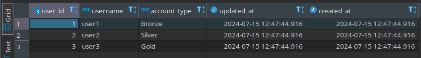
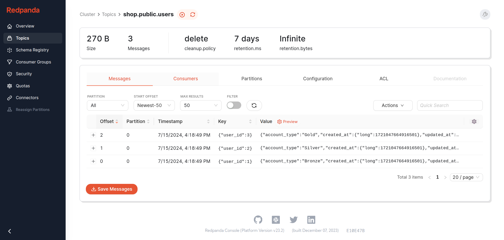
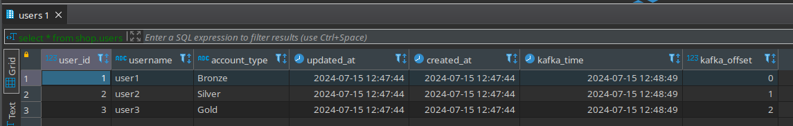

# CDC from PostgreSQL to Kafka to ClickHouse

This repository contains a Docker Compose setup to demonstrate Change Data Capture (CDC) from a PostgreSQL database to Kafka, and then consuming data from Kafka into ClickHouse. This setup includes several services such as Zookeeper, Kafka, Debezium, Schema Registry, Kafka Rest Proxy, Debezium UI, PostgreSQL, ClickHouse, and Redpanda Console.

## Services

- **Zookeeper**: Coordinates and manages the Kafka brokers.
- **Kafka Broker**: Manages the Kafka message broker.
- **Debezium**: Captures changes from the PostgreSQL database and sends them to Kafka.
- **Schema Registry**: Manages schemas for Kafka topics.
- **Kafka Rest Proxy**: Provides a RESTful interface to interact with Kafka.
- **PostgreSQL**: The source database for capturing changes.
- **ClickHouse**: The destination database to consume data from Kafka.
- **Redpanda Console**: A UI for monitoring and managing Kafka.

## Prerequisites

- Docker
- Docker Compose

## Getting Started

1. **Clone the repository**:

    ```sh
    git clone https://github.com/ranjbaryshahab/postgres-cdc-clickhouse.git
    cd postgres-cdc-clickhouse
    ```

2. **Customize the Debezium Docker Image**:

    To use Avro, we need to customize the Debezium Docker image.

    - Build the custom Docker image:

        ```sh
        docker build -t custom-connect .
        ```

3. **Start the services**:

    ```sh
    docker-compose up -d
    ```

4. **Verify the services**:
    - Access the Kafka Rest Proxy at `http://localhost:8082`.
    - Access the Schema Registry at `http://localhost:8081`.
    - Access the Redpanda Console at `http://localhost:9080`.

## Step-by-Step Instructions

### Step 1: Set Up PostgreSQL

1. **Connect to PostgreSQL**:
    You can use a PostgreSQL client or access it directly via Docker:

    ```sh
    docker exec -it postgres psql -U postgres
    ```

2. **Create the `users` table and insert data**:

    ```sql
    CREATE TABLE users (
        user_id SERIAL PRIMARY KEY,
        username VARCHAR(50) NOT NULL,
        account_type VARCHAR(20) NOT NULL,
        updated_at TIMESTAMP DEFAULT timezone('UTC', CURRENT_TIMESTAMP),
        created_at TIMESTAMP DEFAULT timezone('UTC', CURRENT_TIMESTAMP)
    );

    INSERT INTO users (username, account_type) VALUES
    ('user1', 'Bronze'),
    ('user2', 'Silver'),
    ('user3', 'Gold');
    ```

3. **Verify the table data**:

    ```sql
    SELECT * FROM users;
    ```

    

### Step 2: Create Debezium Connector in Kafka Connect

1. **Create the Debezium connector**:

    ```sh
    curl --location --request POST 'http://localhost:8083/connectors' \
    --header 'Content-Type: application/json' \
    --data-raw '{
        "name": "shop-connector",
        "config": {
            "connector.class": "io.debezium.connector.postgresql.PostgresConnector",
            "database.dbname": "postgres",
            "database.history.kafka.bootstrap.servers": "kafka:9092",
            "database.history.kafka.topic": "schema-changes.shop",
            "database.hostname": "postgres",
            "database.password": "postgres",
            "database.port": "5432",
            "database.server.name": "shop",
            "database.user": "postgres",
            "name": "shop-connector",
            "plugin.name": "pgoutput",
            "table.include.list": "public.users",
            "tasks.max": "1",
            "topic.creation.default.cleanup.policy": "delete",
            "topic.creation.default.partitions": "1",
            "topic.creation.default.replication.factor": "1",
            "topic.creation.default.retention.ms": "604800000",
            "topic.creation.enable": "true",
            "topic.prefix": "shop",
            "database.history.skip.unparseable.ddl": "true",
            "value.converter": "io.confluent.connect.avro.AvroConverter",
            "key.converter": "io.confluent.connect.avro.AvroConverter",
            "value.converter.schema.registry.url": "http://schema-registry:8081",
            "key.converter.schema.registry.url": "http://schema-registry:8081",
            "transforms": "unwrap",
            "transforms.unwrap.type": "io.debezium.transforms.ExtractNewRecordState",
            "snapshot.mode": "initial"
        }
    }'
    ```

2. **Verify the connector status**:
    - Access the Debezium UI at `http://localhost:8080` or check the status in the Kafka Connect REST API.

3. **See the result in Redpanda Console**:
    - Go to `http://localhost:9080/topics` to see the topics created by the Debezium connector.

    

### Step 3: Set Up ClickHouse

1. **Create the database and table in ClickHouse**:

    ```sql
    CREATE DATABASE shop;

    CREATE TABLE shop.users
    (
        user_id UInt32,
        username String,
        account_type String,
        updated_at DateTime,
        created_at DateTime,
        kafka_time Nullable(DateTime),
        kafka_offset UInt64
    )
    ENGINE = ReplacingMergeTree
    ORDER BY (user_id, updated_at)
    SETTINGS index_granularity = 8192;
    ```

2. **Create Kafka engine table**:

    ```sql
    CREATE DATABASE kafka_shop;

    CREATE TABLE kafka_shop.kafka__users
    (
        user_id UInt32,
        username String,
        account_type String,
        updated_at UInt64,
        created_at UInt64
    )
    ENGINE = Kafka
    SETTINGS kafka_broker_list = 'broker:29092',
    kafka_topic_list = 'shop.public.users',
    kafka_group_name = 'clickhouse',
    kafka_format = 'AvroConfluent',
    format_avro_schema_registry_url='http://schema-registry:8081';
    ```

3. **Create a materialized view to consume data from Kafka**:

    ```sql
    CREATE MATERIALIZED VIEW kafka_shop.consumer__users TO shop.users
    (
        user_id UInt32,
        username String,
        account_type String,
        updated_at DateTime,
        created_at DateTime,
        kafka_time Nullable(DateTime),
        kafka_offset UInt64
    ) AS
    SELECT
        user_id,
        username,
        account_type,
        toDateTime(updated_at / 1000000) AS updated_at,
        toDateTime(created_at / 1000000) AS created_at,
        _timestamp AS kafka_time,
        _offset AS kafka_offset
    FROM kafka_shop.kafka__users;
    ```

4. **Verify the data in ClickHouse**:

    ```sql
    SELECT * FROM shop.users;
    ```

    

## Configuration
The Docker Compose file (`docker-compose.yml`) contains the configuration for all services, including environment variables, ports, and dependencies. Review and modify it according to your needs.

## Notes
- Ensure all the necessary configuration files for ClickHouse and ClickHouse Keeper are present in the specified directories before starting the services.
- The `wal_level` for PostgreSQL is set to `logical` to enable logical replication required by Debezium.
